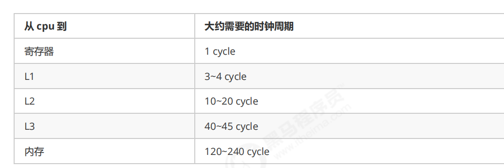

# 多线程学习笔记

#### 1. jvm中线程隔离的区域

​        程序计数器 （记录当前线程执行到哪一行代码）

​		本地方法栈

​		虚拟机栈： 栈帧包含（局部变量表 操作数栈  方法出口 锁记录等）

​		每一个方法执行相当于一个栈帧入栈到出栈的过程

#### 2. cpu的线程上下文切换

​		为了保证每个线程都能运行到 cpu会给每个线程分配时间片（如15ms） 

当cpu时间片的时间耗尽 就需要保存当前线程的信息 然后去执行另外一个线程的时间片

这个过程就是cpu的线程上下文切换

执行上下文切换的时机：

​				线程的 cpu 时间片用完 

​				垃圾回收 

​				有更高优先级的线程需要运行 

​				线程自己调用了 sleep、yield、wait、join、park、synchronized、lock 等方法 

当 Context Switch（线程上下文切换） 发生时，需要由操作系统保存**当前线程的状态**，并恢复另一个线程的状态，Java 中对应的概念 就是程序计数器（Program Counter Register），它的作用是记住下一条 jvm 指令的执行地址，是线程私有的 

当前线程的状态包括：程序计数器、虚拟机栈中每个栈帧的信息，如局部变量、操作数栈、返回地址等 

Context Switch 频繁发生会影响性能

#### 3..线程的基本操作

start():启动一个新线 程，在新的线程 运行 run 方法 中的代码 

join():等待线程运行结束

sleep():让线程休眠n毫秒 休眠时让出cpu时间片

interrupt():打断线程 并且把打断标记设置为true 

​					如果被打断线程正在 sleep，wait，join 会导致被打断 的线程抛出 InterruptedException，并清除打					标记 （打断标记=false）；

​					如果打断的正在运行的线程，则会设置 打断标记(打断标记=true) ；

​					park 的线程被打断，也会设置打断标记 

isInterrupted():返回打断标记

interrupted():返回线程是否被打断线程  并会清楚打断标记

currentThread():返回当前线程

#### 4.设计模式：两阶段终止

​	如何优雅的终止线程

```java
package demo.n2.util;

/**
 * @author zhuliyang
 * @date 2020-03-29
 * @time 23:24
 **/
public class TwoPhaseTermination {
    public static void main(String[] args) throws InterruptedException {
        TwoPhaseTermination t = new TwoPhaseTermination();
        t.start();
        Thread.sleep(5000);
        t.stop();
    }
    Thread monitor;
    //启动监控线程
    public void start(){
        monitor = new Thread(()->{
            while (true){
                if (Thread.currentThread().isInterrupted()){
                    System.out.println("料理后事");
                    break;
                }
                System.out.println("监控线程");
                try {
                    Thread.sleep(2000);
                } catch (InterruptedException e) {
                    Thread.currentThread().interrupt();//设置打断标记
                }
            }
        });
        monitor.start();
    }
    //结束监控线程
    public void stop(){
        monitor.interrupt();
    }
}
```

#### 5.线程的6种状态

NEW:   线程创建出来但是没有运行

RUNNABLE： 线程正在运行中

BLOCKED	：线程由于锁的关系 进入阻塞状态

WAITING	：线程进入无限期等待

TIMED_WATING ：线程进入有限时间的等待

TERMINATED	：线程结束运行

#### 6.synchronized

为什么要用sync?

​			并发读写共享变量时 由于cpu任务调度器的原因 可能出现时间片耗完 任务没完成 切换线程  从而产生数据不一致的问题。

i=1  Ta : i++ ,  Tb i--;  期望： i=0   

实际可能：

i++ 可以分成四步                                 i--可以分成四步

1 获取i													 1 获取i			

2 获取增量1											2 获取增量-1

3 对i进行增加1									   3 对i进行增加-1

4 写入i													 4 写入i

 Ta 在执行i++的时候 还没有完成第4步  时间片耗尽  ，

然后cpu去执行Tb 对i-- 在有效的时间片中 完成了i--,

 然后cpu又回来执行第四步;最后写入i=1;

此时出现了**并发问题**  

sync提供了锁的性质 当被锁住的代码线程在**时间片耗尽还没有释放锁**的时候 会持有锁  别的线程尝试获取锁 但是失败了!会**被阻塞** cpu不会分配时间片去执行 阻塞线程  而是会继续分配时间片去执行持有锁的代码 当代码执行完毕 会释放锁 阻塞的线程将会竞争锁 由cpu来决定给哪个线程持有锁。

sync本质是用锁保证了临界区中代码的**原子性**（最小单位 不可分割）从而不会被线程的上下文切换而打断

##### 线程8锁练习

情况1：12 或 21 

```java
public class ThreadEight {
    public synchronized void a() {
        System.out.println(1);
    }
    public synchronized void b() {
        System.out.println(2);
    }

    public static void main(String[] args) {
        ThreadEight threadEight = new ThreadEight();
        new Thread(()->threadEight.a()).start();
        new Thread(()->threadEight.b()).start();
    }
}
```

情况2：1s后12，或 2 1s后 1

```java
public class ThreadEight {
    public synchronized void a() {
        Thread.sleep(1000);
        System.out.println(1);
    }
    public synchronized void b() {
        System.out.println(2);
    }

    public static void main(String[] args) {
        ThreadEight threadEight = new ThreadEight();
        new Thread(()->threadEight.a()).start();
        new Thread(()->threadEight.b()).start();
    }
}
```

情况3：3 1s 12 或 23 1s 1 或 32 1s 1

```java
public class ThreadEight {
    public synchronized void a() {
        Thread.sleep(1000);
        System.out.println(1);
    }
    public synchronized void b() {
        System.out.println(2);
    }   
    public synchronized void c() {
        System.out.println(3);
    }

    public static void main(String[] args) {
        ThreadEight threadEight = new ThreadEight();
        new Thread(() -> threadEight.a()).start();
        new Thread(() -> threadEight.b()).start();
        new Thread(() -> threadEight.c()).start();
    }
}
```

情况4：2 1s 后 1

```java
public class ThreadEight {
    public synchronized void a() {
        Thread.sleep(1000);
        System.out.println(1);
    }
    public synchronized void b() {
        System.out.println(2);
    }
    
    public static void main(String[] args) {
        ThreadEight threadEight = new ThreadEight();
        ThreadEight threadEight2 = new ThreadEight();
        new Thread(() -> threadEight.a()).start();
        new Thread(() -> threadEight2.b()).start();
    }
}
```

情况5：2 1s 后 1

```java
public class ThreadEight {
    public synchronized void a() {
        Thread.sleep(1000);
        System.out.println(1);
    }
    public static synchronized void b() {
        System.out.println(2);
    }

    public static void main(String[] args) {
        ThreadEight threadEight = new ThreadEight();
        ThreadEight threadEight2 = new ThreadEight();
        new Thread(() -> threadEight.a()).start();
        new Thread(() -> threadEight2.b()).start();
    }
}
```

情况6：1s 后12， 或 2 1s后 1

```java
public class ThreadEight {
    public static synchronized void a() {
        Thread.sleep(1000);
        System.out.println(1);
    }
    public static synchronized void b() {
        System.out.println(2);
    }

    public static void main(String[] args) {
        ThreadEight threadEight = new ThreadEight();
        new Thread(() -> threadEight.a()).start();
        new Thread(() -> threadEight.b()).start();
    }
}
```

情况7：2 1s 后 1

```java
public class ThreadEight {
    public static synchronized void a() {
        Thread.sleep(1000);
        System.out.println(1);
    }
    public synchronized void b() {
        System.out.println(2);
    }

    public static void main(String[] args) {
        ThreadEight threadEight = new ThreadEight();
        ThreadEight threadEight2 = new ThreadEight();
        new Thread(() -> threadEight.a()).start();
        new Thread(() -> threadEight2.b()).start();
    }
}
```

情况8：1s 后12， 或 2 1s后 1

```java
public class ThreadEight {
    public static synchronized void a() {
        Thread.sleep(1000);
        System.out.println(1);
    }
    public static synchronized void b() {
        System.out.println(2);
    }

    public static void main(String[] args) {
        ThreadEight threadEight = new ThreadEight();
        ThreadEight threadEight2 = new ThreadEight();
        new Thread(() -> threadEight.a()).start();
        new Thread(() -> threadEight2.b()).start();
    }
}
```

##### 卖票案例

```java
public class TicketWindow {
    int count = 10000;
    public int sell(){
        if (count>0){
            count--;
            return 1;
        }
        return 0;     
    }

    public static void main(String[] args) throws InterruptedException {
        TicketWindow ticketWindow = new TicketWindow();
        AtomicInteger sell = new AtomicInteger();
        for (int i = 0; i <5000 ; i++) {//模拟5000人买票
            new Thread(()->{
                sell.addAndGet(ticketWindow.sell());
            }).start();
        }
        Thread.sleep(2000);
        System.out.println("卖出"+sell);
        System.out.println("剩余"+ticketWindow.count);
    }
}

卖出5000
剩余5001
解决方法:TicketWindow.sell()方法 加sync //public synchroized int sell()
```

转账案例

```java
package demo.n2;

/**
 * @author zhuliyang
 * @date 2020-04-01
 * @time 0:51
 **/
public class Amount {
    int amount = 1000;

    public  void transfer(Amount anOther, int money) {//给对方账户转账
        this.amount -= money;
        anOther.amount += money;
    }

    public static void main(String[] args) throws InterruptedException {
        Amount a = new Amount();
        Amount b = new Amount();
        Thread t1 = new Thread(() -> {
            for (int i = 0; i < 1000; i++) {
                a.transfer(b, 1);
            }
        });
        Thread t2 = new Thread(() -> {
            for (int i = 0; i < 1000; i++) {
                b.transfer(a, 1);
            }
        });
        t1.start(); t2.start();
        t1.join(); t2.join();
        System.out.println(a.amount+b.amount);
    }
}
运行5次结果：1964 2001  2000 1997 1981 
解决方法  由于是两个对象 需要加类锁   
//   public void transfer(Amount anOther, int money) {//给对方账户转账
//        synchronized (Amount.class) {
//            this.amount -= money;
//            anOther.amount += money;
//        }
//    }
```

##### **Monitor**管程

​	java对象头

​			对象由两部分组成  Mark word  ,  Klass Word （指向对象类型的指针）

​     Mark word   64bit   组成

| unused     | hashcode               | thread                         | age      | biased_lock | 最后两位 |
| ---------- | ---------------------- | ------------------------------ | -------- | ----------- | :------: |
| 未使用空间 | 哈希码                 | 线程信息                       | 分代年龄 | 偏向锁标志  | 加锁状态 |
| **epoch**  | **ptr_to_lock_record** | **ptr_to_heavyweight_monitor** |          |             |          |
| 选择器     | 栈中的锁信息           | 管程信息                       |          |             |          |


Monitor ：操作系统中的管程

每个 Java 对象都可以关联一个 Monitor 对象，如果使用 synchronized 给对象上锁（重量级）之后，该对象头的 

Mark Word 中就被设置指向 Monitor 对象的指针 

Monitor 结构如下


##### 重量级锁

刚开始 Monitor 中 Owner 为 null 

当 Thread-2 执行 synchronized(obj) 就会将 Monitor 的所有者 Owner 置为 Thread-2，Monitor中只能有一 

个 Owner 

在 Thread-2 上锁的过程中，如果 Thread-3，Thread-4，Thread-5 也来执行 synchronized(obj)，就会进入 

EntryList BLOCKED 

Thread-2 执行完同步代码块的内容，然后唤醒 EntryList 中等待的线程来竞争锁，竞争的时是非公平的 

图中 WaitSet 中的 Thread-0，Thread-1 是之前获得过锁，但条件不满足进入 WAITING 状态的线程，后面讲 

wait-notify 时会分析 

##### 轻量级锁

轻量级锁的使用场景：如果一个对象虽然有多线程要加锁，但加锁的时间是错开的（也就是没有竞争 某段时间始终只有一个线程在调用这个锁），那么可以使用轻量级锁来优化。 


当线程执行锁方法时  jvm会在线程的栈帧中创建锁记录  

当第一个锁记录被创建的时候，让锁记录中 Object reference 指向锁对象，并尝试用 cas 替换锁记录的头信息和Object 的 Mark Word，将 Mark Word 的值存 入锁记录


如果 cas 替换成功，对象头中存储了 锁记录地址和状态 00 ，表示由该线程给对象加锁，这时图示如下


如果 cas 失败，有两种情况 

如果是其它线程已经持有了该 Object 的轻量级锁，这时表明有竞争，进入**锁膨胀**过程  升级为重量级锁

如果是自己执行了 synchronized 锁重入，那么再添加一条 Lock Record 作为重入的计数 

object reference 指向锁对象  lock record 头信息置为null


当退出 synchronized 代码块（解锁时）如果有取值为 null 的锁记录，表示有重入，这时栈顶锁记录出栈，表示重 

入计数减一

当退出 synchronized 代码块（解锁时）锁记录的值不为 null，这时使用 cas 将 Mark Word 的值恢复给对象 

头 

成功，则解锁成功 

失败，说明轻量级锁进行了锁膨胀或已经升级为重量级锁，进入重量级锁解锁流程 

##### 锁膨胀

当thread1 使用轻量级锁cas替换锁对象的对象头时 发现锁对象的对象头已经被thread0替换 则会进入重量级锁流程  锁对象的对象头指向操作系统monitor管程 管程中的owner指向thread0  thread1进入entryList;


这时 Thread-1 加轻量级锁失败，进入锁膨胀流程 

即为 Object 对象申请 Monitor 锁，让 Object 指向重量级锁地址 

然后自己进入 Monitor 的 EntryList BLOCKED 


当 Thread-0 退出同步块解锁时，使用 cas 将 Mark Word 的值恢复给对象头，失败。这时会进入重量级解锁 

流程，即按照 Monitor 地址找到 Monitor 对象，设置 Owner 为 null，唤醒 EntryList 中 BLOCKED 线程 

##### 重量级锁自旋优化

重量级锁 entryList 中的线程竞争的时候  会先自旋一段时间  如果当前线程自旋成功（即这时候持锁线程已经退出了同步块，释放了锁），这时当前线程就可以避免阻塞。 变成owner 

阻塞会发生线程的上下文切换 相对于短时间自旋消耗较大。


自旋会占用 CPU 时间，单核 CPU 自旋就是浪费，多核 CPU 自旋才能发挥优势。 

在 Java 6 之后自旋锁是自适应的，比如对象刚刚的一次自旋操作成功过，那么认为这次自旋成功的可能性会 

高，就多自旋几次；反之，就少自旋甚至不自旋，总之，比较智能。 

Java 7 之后不能控制是否开启自旋功能 

##### 偏向锁

轻量级锁在没有竞争时（就自己这个线程），每次重入仍然需要执行 CAS 操作。 

Java 6 中引入了偏向锁来做进一步优化：**只有第一次使用 CAS** 将线程 ID 设置到对象的 Mark Word 头，之后发现 

这个线程 ID 是自己的就表示没有竞争，不用重新 CAS。以后只要不发生竞争，这个对象就归该线程所有 

一个对象创建时： 

如果开启了偏向锁（默认开启），那么对象创建后，markword 值为 0x05 即最后 3 位为 101，这时它的 

thread、epoch、age 都为 0 

偏向锁是默认是延迟的，不会在程序启动时立即生效，如果想避免延迟，可以加 VM 参数 - 

XX:BiasedLockingStartupDelay=0 来禁用延迟 

如果没有开启偏向锁，那么对象创建后，markword 值为 0x01 即最后 3 位为 001，这时它的 hashcode、 

age 都为 0，第一次用到 hashcode 时才会赋值 

##### 偏向锁撤销

**hashcode撤销**

如果调用了对象的hashcode方法 偏向锁的会被取消（应为markword只有64位） hashcode要占用31位 而锁记录要占用54位

轻量级锁会在锁记录中记录 hashCode 

重量级锁会在 Monitor 中记录 hashCode

**多线程访问撤销**

如果多个线程进行访问一个对象 会撤销对象的偏向锁 进入锁升级的过程  如果多线程不是同一时间段访问 会升级成**轻量级锁**  反之 会升级成**重量级锁**

**调用对象的wait/notify时撤销**

wait/notify只有重量级锁才有

**偏向锁升级轻量级锁的代码**

```java
public class TestBiased {
    private static void test2() throws InterruptedException {
        Dog d = new Dog();
        Thread t1 = new Thread(() -> {
            synchronized (d) {//dog对象开始的时候 markword头里面记录着偏向锁的记录
            }
            //此时释放锁  markword头里面记录着偏向锁的记录
            synchronized (TestBiased.class) { //唤醒等待的线程
                TestBiased.class.notify();
            }
        }, "t1");
        t1.start();
        Thread t2 = new Thread(() -> {
            synchronized (TestBiased.class) {//t2执行的时候 直接等待
                try {
                    TestBiased.class.wait();
                } catch (InterruptedException e) {
                    e.printStackTrace();
                }
            }
            //此时t2线程持有锁 应为有两个线程持有锁 所以偏向锁升级成轻量级锁 markword被变更
            synchronized (d) {
            }
        }, "t2");
        t2.start();
    }
}
class Dog {

}
```

##### 批量重偏向

如果对象虽然被多个线程访问，但没有竞争，这时偏向了线程 T1 的对象仍有机会重新偏向 T2，重偏向会重置对象 的 Thread ID 

当撤销偏向锁阈值超过 20 次后，jvm 会这样觉得，我是不是偏向错了呢，于是会在给这些对象加锁时重新偏向至 

加锁线程 

##### 批量撤销

当撤销偏向锁阈值超过 40 次后，jvm 会这样觉得，自己确实偏向错了，根本就不该偏向。于是整个类的所有对象 

都会变为不可偏向的，新建的对象也是不可偏向的

##### 锁消除

jvm 会有即时分析器jit 会分析代码运行的时候是否需要加锁 

如下代码  对成员变量o进行加锁  但是这一行为没有意义 所以会执行锁消除

```java
public void b() throws Exception {
 Object o = new Object();
 synchronized (o) {
 x++;
 }
```

#### 7.wait/notify/notifyAll

Owner 线程发现条件不满足，调用 wait 方法，即可进入 WaitSet 变为 WAITING 状态 

BLOCKED 和 WAITING 的线程都处于阻塞状态，不占用 CPU 时间片 

BLOCKED 线程会在 Owner 线程释放锁时唤醒 

WAITING 线程会在 Owner 线程调用 notify 或 notifyAll 时唤醒，但唤醒后并不意味者立刻获得锁，仍需进入 

EntryList 重新竞争 

**sleep和wait的区别**

sleep持有锁  wait会放弃锁   

sleep(time)和wait(time) 都是TIMED_WAITING 状态

#### 8.保护性暂停模式

防止虚假唤醒  并且带有时间的等待  

```java
@Slf4j
public class ProtectedStop {
     static  Object res;
    public static void main(String[] args) {
        Object lock = new Object();
        int watiTime = 10000;
        new Thread(() -> {
            log.debug("开始线程");
            long before  = System.currentTimeMillis();
            synchronized (lock) {
                while (res == null) {
                    long after =System.currentTimeMillis();
                    long currentWaitTime = after-before;
                    if (currentWaitTime>=watiTime)break;
                    try {
                        lock.wait(watiTime-currentWaitTime);
                    } catch (InterruptedException e) {
                        e.printStackTrace();
                    }
                }
                log.debug("开始干活");
            }

        }).start();
        new Thread(() -> {
            synchronized (lock) {
                try {
                    Thread.sleep(3000);
                } catch (InterruptedException e) {
                    e.printStackTrace();
                }
                res = new Object();
                lock.notify();
            }
        }).start();
    }
}
```

#### 9.线程间状态转换

**情况** **1** **NEW** **--> RUNNABLE** 

当调用 t.start() 方法时，由 NEW --> RUNNABLE 

**情况** **2** **RUNNABLE <--> WAITING** 

**t** **线程**用 synchronized(obj) 获取了对象锁后 

调用 obj.wait() 方法时，**t** **线程**从 RUNNABLE --> WAITING 

调用 obj.notify() ， obj.notifyAll() ， t.interrupt() 时 

竞争锁成功，**t** **线程**从 WAITING --> RUNNABLE 

竞争锁失败，**t** **线程**从 WAITING --> BLOCKED 

**情况** **3** **RUNNABLE <--> WAITING** 

**当前线程**调用 t.join() 方法时，**当前线程**从 RUNNABLE --> WAITING 

注意是**当前线程**在**t** **线程对象**的监视器上等待 

**t** **线程**运行结束，或调用了**当前线程**的 interrupt() 时，**当前线程**从 WAITING --> RUNNABLE 

**情况** **4** **RUNNABLE <--> WAITING** 

当前线程调用 LockSupport.park() 方法会让当前线程从 RUNNABLE --> WAITING 

调用 LockSupport.unpark(目标线程) 或调用了线程 的 interrupt() ，会让目标线程从 WAITING -->  

RUNNABLE 

**情况** **5** **RUNNABLE <--> TIMED_WAITING** 

**t** **线程**用 synchronized(obj) 获取了对象锁后 

调用 obj.wait(long n) 方法时，**t** **线程**从 RUNNABLE --> TIMED_WAITING 

**t** **线程**等待时间超过了 n 毫秒，或调用 obj.notify() ， obj.notifyAll() ， t.interrupt() 时 

竞争锁成功，**t** **线程**从 TIMED_WAITING --> RUNNABLE 

竞争锁失败，**t** **线程**从 TIMED_WAITING --> BLOCKED 

**情况** **6** **RUNNABLE <--> TIMED_WAITING** 

**当前线程**调用 t.join(long n) 方法时，**当前线程**从 RUNNABLE --> TIMED_WAITING 

注意是**当前线程**在**t** **线程对象**的监视器上等待 

**当前线程**等待时间超过了 n 毫秒，或**t** **线程**运行结束，或调用了**当前线程**的 interrupt() 时，**当前线程**从 

TIMED_WAITING --> RUNNABLE 

**情况** **7** **RUNNABLE <*--> TIMED_WAITING** 

当前线程调用 Thread.sleep(long n) ，当前线程从 RUNNABLE --> TIMED_WAITING 

**当前线程**等待时间超过了 n 毫秒，**当前线程**从 TIMED_WAITING --> RUNNABLE 

**情况** **8** **RUNNABLE <--> TIMED_WAITING** 

当前线程调用 LockSupport.parkNanos(long nanos) 或 LockSupport.parkUntil(long millis) 时，**当前线** 

**程**从 RUNNABLE --> TIMED_WAITING 

调用 LockSupport.unpark(目标线程) 或调用了线程 的 interrupt() ，或是等待超时，会让目标线程从 

TIMED_WAITING--> RUNNABLE 

**情况** **9** **RUNNABLE <--> BLOCKED** 

**t** **线程**用 synchronized(obj) 获取了对象锁时如果竞争失败，从 RUNNABLE --> BLOCKED 

持 obj 锁线程的同步代码块执行完毕，会唤醒该对象上所有 BLOCKED 的线程重新竞争，如果其中 **t** **线程**竞争 

成功，从 BLOCKED --> RUNNABLE ，其它失败的线程仍然 BLOCKED 

**情况** **10** **RUNNABLE <--> TERMINATED** 

当前线程所有代码运行完毕，进入 TERMINATED 

#### 10.多把锁

##### 死锁练习

```java
public class SiSuo {
    Object o1 = new Object();
    Object o2 = new Object();
    public void test1(){
        synchronized (o1){
            try {
                Thread.sleep(1000);
            } catch (InterruptedException e) {
                e.printStackTrace();
            }
            synchronized (o2){ //获取o2时o2被占有--->进入阻塞状态
                System.out.println(1123);
            }
        }
    }
    public void test2(){
        synchronized (o2){
            try {
                Thread.sleep(1000);
            } catch (InterruptedException e) {
                e.printStackTrace();
            }
            synchronized (o1){//获取o1时o1被占有---->进入阻塞状态
                System.out.println(1123);
            }
        }
    }

    public static void main(String[] args) {
        SiSuo siSuo = new SiSuo();
        new Thread(()->siSuo.test1()).start();
        new Thread(()->siSuo.test2()).start();
    }
}
```

#### 11.ReentrantLock

特性：可重入锁，

可打断锁：	

​					加锁lock.lockInterruptibly();     其他线程可以调用  t1.interrupt();方法执行打断  

​					注意如果是不可中断模式，那么即使使用了 interrupt 也不会让等待中断

可等待锁超时：

​					可以使用lock.tryLock()   如果获取不到锁 就不再获取锁线程直接变成TERMINATED

​					可以使用lock.tryLock(long timeout, TimeUnit unit)   如果在指定时间内获取不到锁 就不再获取锁线 					程直接变成TERMINATED

​					TryLock解决死锁代码

```java
@Slf4j
public class DeadLock {
    public static void main(String[] args) {
        ReentrantLock lock1 = new ReentrantLock();
        ReentrantLock lock2 = new ReentrantLock();
        new Thread(() -> {
            lock1.lock();
            log.info("loc1加锁");
            try {
                log.info("开始loc2加锁");
                if (!lock2.tryLock(3, TimeUnit.SECONDS)) {
                    log.info("loc2加锁失败");
                    return;
                }
                lock2.unlock();
                log.info("loc2解锁");
            } catch (InterruptedException e) {
                e.printStackTrace();
            }
            lock1.lock();
            log.info("loc1解锁");
        }).start();
        new Thread(() -> {
            lock2.lock();
            log.info("loc2加锁");
            try {
                log.info("开始loc1加锁");
                if (!lock1.tryLock(3, TimeUnit.SECONDS)) {
                    log.info("loc1加锁失败");
                    return;
                }
                lock1.unlock();
                log.info("loc1解锁");
            } catch (InterruptedException e) {
                e.printStackTrace();
            }
            lock2.lock();
            log.info("loc2解锁");
        }).start();
    }
}
```

可设置公平性 

```java
ReentrantLock lock = new ReentrantLock(true);
//设置了公平性之后  阻塞队列中获取锁的先后顺序 会按照他的进入阻塞队列的顺序来获得
//但是 如果设置了公平锁 并发度会降低
```

可设置waitSet,

synchronized 中也有条件变量，就是我们讲原理时那个 waitSet 休息室，当条件不满足时进入 waitSet 等待 

ReentrantLock 的条件变量比 synchronized 强大之处在于，它是支持多个条件变量的，这就好比 

synchronized 是那些不满足条件的线程都在一间休息室等消息 

而 ReentrantLock 支持多间休息室，有专门等烟的休息室、专门等早餐的休息室、唤醒时也是按休息室来唤 

醒 

使用要点： 

await 前需要获得锁 

await 执行后，会释放锁，进入 conditionObject 等待 

await 的线程被唤醒（或打断、或超时）取重新竞争 lock 锁 

竞争 lock 锁成功后，从 await 后继续执行

代码示例

```java
@Slf4j
public class TestCondition {
    public static void main(String[] args) {
        ReentrantLock lock = new ReentrantLock();
        Condition condition1 = lock.newCondition();
        Condition condition2 = lock.newCondition();
        new Thread(() ->{
            lock.lock();
            try {
                log.debug("开始等烟");
                condition1.await();
            } catch (InterruptedException e) {
                e.printStackTrace();
            }
            log.debug("开始抽烟");
            lock.unlock();
        }).start();
        new Thread(() ->{
            lock.lock();
            try {
                log.debug("开始等外卖");
                condition2.await();
            } catch (InterruptedException e) {
                e.printStackTrace();
            }
            log.debug("开始吃外卖");
            lock.unlock();
        }).start();
        Sleeper.sleep(3);
        lock.lock();
        log.debug("烟来了");
        condition1.signal();
        log.debug("外卖来了");
        condition2.signal();
        lock.unlock();
    }
}
```

#### 12 多线程顺序控制

wait/notify 版本

```java
public class PrintABCWaitNotify {
    int flag = 1;

    public void print(int curflag, int nextFalg, String str) {
        synchronized (this) {
            for (int i = 0; i < 5; i++) {
                while (flag != curflag) {
                    try {
                        this.wait();
                    } catch (InterruptedException e) {
                        e.printStackTrace();
                    }
                }
                System.out.print(str);
                this.notifyAll();
                flag = nextFalg;
            }
        }
    }

    public static void main(String[] args) {
        PrintABCWaitNotify p = new PrintABCWaitNotify();
        new Thread(() -> { p.print(1, 2, "A"); }).start();
        new Thread(() -> { p.print(2, 3, "B"); }).start();
        new Thread(() -> { p.print(3, 1, "C"); }).start();
    }
}
```

ReentrantLock版本1

```java
public class PrintABCReentrantLock {
    int flag = 1;
    ReentrantLock lock = new ReentrantLock();
    Condition condition = lock.newCondition();

    public void print(int cur, int next, String str) {
        for (int i = 0; i < 5; i++) {
            try {
                lock.lock();
                while (flag!=cur){
                    condition.await();
                }
                System.out.print(str);
            } catch (InterruptedException e) {
                e.printStackTrace();
            } finally {
                condition.signalAll();
                flag = next;
                lock.unlock();
            }
        }
    }

    public static void main(String[] args) {
        PrintABCReentrantLock p = new PrintABCReentrantLock();
        new Thread(() ->{p.print(1,2 , "A");}).start();
        new Thread(() ->{p.print(2,3 , "B");}).start();
        new Thread(() ->{p.print(3,1 , "C");}).start();
    }
}
```

ReentrantLock版本2

```java
public class PrintABCReentrantLock2 {
    public static void main(String[] args) {
        ReentrantLock lock = new ReentrantLock();
        Condition condition1 = lock.newCondition();
        Condition condition2 = lock.newCondition();
        Condition condition3 = lock.newCondition();
        new Thread(() -> {
            lock.lock();
            for (int i = 0; i < 5; i++) {
                try {
                    condition1.await();
                    System.out.print("A");
                    condition2.signal();
                } catch (InterruptedException e) {
                    e.printStackTrace();
                }
            }
            lock.unlock();
        }).start();
        new Thread(() -> {
            lock.lock();
            for (int i = 0; i < 5; i++) {
                try {
                    condition2.await();
                    System.out.print("B");
                    condition3.signal();
                } catch (InterruptedException e) {
                    e.printStackTrace();
                }
            }
            lock.unlock();
        }).start();
        new Thread(() -> {
            lock.lock();
            for (int i = 0; i < 5; i++) {
                try {
                    condition3.await();
                    System.out.print("C");
                    condition1.signal();
                } catch (InterruptedException e) {
                    e.printStackTrace();
                }
            }
            lock.unlock();
        }).start();
        Sleeper.sleep(1);
        lock.lock();
        condition1.signal();
        lock.unlock();
    }
}
```

park/unpark 版本

```java
public class PrintABCParkUnPark {
    static Thread t1;
    static Thread t2;
    static Thread t3;
    public static void main(String[] args) {
         t1= new Thread(() ->{
            for (int i = 0; i <5 ; i++) {
                LockSupport.park();
                System.out.print("A");
                LockSupport.unpark(t2);
            }
        });
        t2= new Thread(() ->{
            for (int i = 0; i <5 ; i++) {
                LockSupport.park();
                System.out.print("B");
                LockSupport.unpark(t3);
            }
        });
        t3= new Thread(() ->{
            for (int i = 0; i <5 ; i++) {
                LockSupport.park();
                System.out.print("C");
                LockSupport.unpark(t1);
            }
        });
        t1.start();
        t2.start();
        t3.start();
        LockSupport.unpark(t1);
    }
}
```

总结：synchionzed 是jvm层面 c++实现

​			rerntrantLock 是java层面 java实现

​			LockSupport 是操作系统层面 c实现

#### 13.jmm

内存可见性

下面代码会发生结束不了的问题

```java
public class Test {
    static  boolean  run = true;
    public static void main(String[] args) {
        new Thread(() ->{
            while (run){

            }
            System.out.println("jeishule1");
        }).start();
        Sleeper.sleep(5);
        run=false;
    }
}
```

1. 初始状态， t 线程刚开始从主内存读取了 run 的值到工作内存。

   

   2. 因为 t 线程要频繁从主内存中读取 run 的值，JIT 编译器会将 run 的值缓存至自己工作内存中的高速缓存中， 

   减少对主存中 run 的访问，提高效率

   


3. 5 秒之后，main 线程修改了 run 的值，并同步至主存，而 t 是从自己工作内存中的高速缓存中读取这个变量 

的值，结果永远是旧值


​	解决办法

```java
static  volatile   boolean  run = true;
```

synchionized: 可见性，原子性

volatile : 可见性

**指令重排**

事实上，现代处理器会设计为一个时钟周期完成一条执行时间最长的 CPU 指令。为什么这么做呢？可以想到指令 

还可以再划分成一个个更小的阶段，例如，每条指令都可以分为： 取指令 - 指令译码 - 执行指令 - 内存访问 - 数据 

写回 这 5 个阶段 


在不改变程序结果的前提下，这些指令的各个阶段可以通过**重排序**和**组合**来实现**指令级并行**，这一技术在 80's 中 

叶到 90's 中叶占据了计算架构的重要地位。 

**提示：** 

分阶段，分工是提升效率的关键！ 

指令重排的前提是，重排指令不能影响结果，例如

**** **支持流水线的处理器** 

现代 CPU 支持**多级指令流水线**，例如支持同时执行 取指令 - 指令译码 - 执行指令 - 内存访问 - 数据写回 的处理 

器，就可以称之为**五级指令流水线**。这时 CPU 可以在一个时钟周期内，同时运行五条指令的不同阶段（相当于一 

条执行时间最长的复杂指令），IPC = 1，本质上，流水线技术并不能缩短单条指令的执行时间，但它变相地提高了 **指令地吞吐率**。 


由于cpu支持多级流水线处理  在不改变运算结果的情况下，为了提高指令吞吐率， cpu会进行指令重排序！ 

如下代码

```java
@JCStressTest
@Outcome(id = {"1", "4"}, expect = Expect.ACCEPTABLE, desc = "ok")
@Outcome(id = "0", expect = Expect.ACCEPTABLE_INTERESTING, desc = "!!!!")
@State
public class ConcurrencyTest {

    int num = 0;
    boolean ready = false;
    @Actor
    public void actor1(I_Result r) {
        if(ready) {
            r.r1 = num + num;
        } else {
            r.r1 = 1;
        }
    }

    @Actor
    public void actor2(I_Result r) {
        num = 2;
        ready = true;
    }

}
```

4000万次并发测试之后

线程1返回的结果中r.r1 会有三种情况  

```java
           0         1,515   ACCEPTABLE_INTERESTING  !!!!
           1    11,815,113               ACCEPTABLE  ok
           4    26,080,973               ACCEPTABLE  ok
```
1 对应actor1先执行

4 对应actor2先执行

0 对应actor2被指令重排   actor2执行到第1行结束 第二行未开始   actor1方法执行   r.r1 =  0 + 0;

```java
@Actor
public void actor2(I_Result r) {
    ready = true; //1
    num = 2; //2
}
```

解决办法 ：防止指令重排

```java
public class ConcurrencyTest {

    int num = 0;
    volatile boolean ready = false; //添加volatile关键字 可以防止本行和之前的行指令重排序
	//.....
}
```

volatile 保证了有序性。

#### 14. volatile

volatile  本质是给指令加了一层内存屏障  

**可见性**

对volatile变量的写指令之后 会加入写屏障： 写屏障保证在写屏障之前的共享变量的变动，全部都写到主存中

对volatile变量的读指令之前 会加入读屏障：读屏障保证在读屏障之后的读取， 全部去主存中去读

```java
public void actor2(I_Result r) { 

 int num = 2; 
 volatile boolean ready = true; // ready 是 volatile 赋值带内存屏障 

 public void write(){
     new Thread(()->{
         num =1;
         ready =false;
         //写屏障  会把写屏障之前的写变化 全部写道主存中
     }).start();
 }
    
 public void read(){
     new Thread(()->{
         //读屏障  读屏障保证在读屏障之后的读取， 全部去主存中去读
		 boolean res = ready;
         int i = num;
     }).start();
 }

}
```

**有序性**

写屏障保证了 指令重排时 写屏障之后的代码 不会被重排到写屏障之前

读屏障保证了 指令重排时 读屏障之前的代码 不会被重排到读屏障之后 

更底层是读写变量时使用 lock 指令来多核 CPU 之间的可见性与有序性

#### 15.happens-before

线程解锁 m 之前对变量的写，对于接下来对 m 加锁的其它线程对该变量的读可见

```java
static int x; 
static Object m = new Object(); 

new Thread(()->{ 
 synchronized(m) { 
 	x = 10;
  }
},"t1").start();
new Thread(()->{
 synchronized(m) {
 	System.out.println(x);
  }
},"t2").start()
```

线程对 volatile 变量的写，对接下来其它线程对该变量的读可见

```java
volatile static int x;
new Thread(()->{
 x = 10;
},"t1").start();
new Thread(()->{
 System.out.println(x);
},"t2").start();
```

线程 start 前对变量的写，对该线程开始后对该变量的读可见

```java
static int x; x = 10;
new Thread(()->{
 System.out.println(x);
},"t2").start();
```

线程结束前对变量的写，对其它线程得知它结束后的读可见（比如其它线程调用 t1.isAlive() 或 t1.join()等待 

它结束） 

```java
static int x;
Thread t1 = new Thread(()->{
 x = 10;
},"t1");
t1.start();
t1.join();
System.out.println(x);
```

线程 t1 打断 t2（interrupt）前对变量的写，对于其他线程得知 t2 被打断后对变量的读可见（通过 

t2.interrupted 或 t2.isInterrupted） 

```java
static int x;
public static void main(String[] args) {
 Thread t2 = new Thread(()->{
 while(true) {
 if(Thread.currentThread().isInterrupted()) {
 System.out.println(x);
 break;
 }
 }
 },"t2");
 t2.start();
 new Thread(()->{
 sleep(1);
 x = 10;
 t2.interrupt();
 },"t1").start();
 while(!t2.isInterrupted()) {
 Thread.yield();
 }
 System.out.println(x);
}
```

对变量默认值（0，false，null）的写，对其它线程对该变量的读可见 

具有传递性，如果 x hb-> y 并且 y hb-> z 那么有 x hb-> z ，配合 volatile 的防指令重排，有下面的例子

```java
volatile static int x;
static int y;
new Thread(()->{ 
 y = 10;
 x = 20;
},"t1").start();
new Thread(()->{
 // x=20 对 t2 可见, 同时 y=10 也对 t2 可见
 System.out.println(x); 
},"t2").start();
```

#### 16 CAS

cas是一种无锁的并发  体现的思想是比较并交换 cas需要配合volatile 一起使用才可以保证无锁并发

```java
public class CastTest {
    public static void main(String[] args) {
        Inner inner = new Inner();
        for (int i = 0; i <100 ; i++) {
            new Thread(()->{inner.add(10);}).start();
        }
        Sleeper.sleep(1);
        System.out.println(inner.get());
    }

    static class Inner {
        AtomicInteger i = new AtomicInteger();
        int get() {
            return i.get();
        }
        void add(int inc) {
            while (true) {
                int except = this.i.get();
                int update = except + inc;
                //比较并交换 如果期望值=主存中的值 就进行交换 并返回true 跳出循环 否则 返回false 进入下次循环
                if (i.compareAndSet(except, update)) {
                    return;
                }
            }
        }
    }
}
```

cas并不会无线的自旋  jvm会控制自旋的次数 如果多次自旋失败  那么就会停止自旋 cas失败

```java
//极限并发下 jvm会控制自旋的次数  cas会失败
public class MyAtomicInteger {
    Unsafe unsafe;
    int value;
    long valueOffset;
    public MyAtomicInteger(int initValue) throws NoSuchFieldException, IllegalAccessException {
        Field theUnsafe = Unsafe.class.getDeclaredField("theUnsafe");
        theUnsafe.setAccessible(true);
        //反射获取对象
        this.unsafe = (Unsafe) theUnsafe.get(null);
        Field fieldValue = MyAtomicInteger.class.getDeclaredField("value");
        //获取域的偏移地址
        this.valueOffset = unsafe.objectFieldOffset(fieldValue);
        this.value = initValue;
    }
    public void add(int add){
            int prev = value;
            int post = value+add;
            if(!unsafe.compareAndSwapInt(this, valueOffset,prev , post)){
                System.out.println(false);
            }
    }

    public static void main(String[] args) throws NoSuchFieldException, IllegalAccessException {
        MyAtomicInteger myAtomicInteger = new MyAtomicInteger(0);
        for (int i = 0; i <100000 ; i++) {
            new Thread(()->{myAtomicInteger.add(1);}).start();
        }
        Sleeper.sleep(3);//等3秒
        System.out.println(myAtomicInteger.value);
    }
}

//打印
//false
//false
//false
//false
//false
//false
//false
//false
//false
//false
//false
//false
//false
//false
//false
//99985
```

CAS 是基于乐观锁的思想：最乐观的估计，不怕别的线程来修改共享变量，就算改了也没关系，我吃亏点再 

重试呗。 

synchronized 是基于悲观锁的思想：最悲观的估计，得防着其它线程来修改共享变量，我上了锁你们都别想 

改，我改完了解开锁，你们才有机会。 

CAS 体现的是无锁并发、无阻塞并发，请仔细体会这两句话的意思 

因为没有使用 synchronized，所以线程不会陷入阻塞，这是效率提升的因素之一 

但如果竞争激烈，可以想到重试必然频繁发生，反而效率会受影响

#### 17.AtomicInteger

```java
public class CastTest {
    public static void main(String[] args) {
        Inner inner = new Inner();
        for (int i = 0; i <10; i++) {
            new Thread(()->{inner.calculate(prev -> ((prev*2)+3)/2 );}).start();
        }
        Sleeper.sleep(1);
        System.out.println(inner.get());
    }

    static class Inner {
        AtomicInteger i = new AtomicInteger(1);
        int get() {
            return i.get();
        }
        void add(int inc) {
            while (true) {
                int except = this.i.get();
                int update = except + inc;
                if (i.compareAndSet(except, update)) {
                    return;
                }
            }
        }
        void calculate(Eval eval) {
            while (true) {
                int except = this.i.get();
                int update = eval.calculate(except);//通过接口计算后的值
                if (i.compareAndSet(except, update)) {
                    return;
                }
            }
        }
    }
}
```

```java
@FunctionalInterface
public interface Eval {
    //接口的计算过程由实现类来实现
    int calculate(int prev);
}
```

18 cas ABA问题

对于cas操作  如果本线程想改变值A->B, 如果此时其他线程对对象值做了修改 例如 从A->B  B->A  对于本线程是无法感知到的  ,依旧会cas操作成功。

如何解决cas ABA问题？

添加版本号   用自带版本号的原子类 AtomicStampedReference 这个类内部有一个版本号  被线程修改一次 版本号+1；

#### 18.原子累加器

自jdk8 之后 有一类新的原子类 专门用来做累加  如 LongAdder  性能比AtomicInteger 快 5倍左右

为什么这么快？？

传统的cas操作 当竞争激烈是 cas操作就会失败概率变高  自旋的次数也就增加 耗时也就增加

LongAdder 内部维护了多个累加单元 （与cpu的核心数有关）当竞争激烈时 它可以对多个累加单元同时做cas操作

最后再把累加单元的值汇总即可。 

#### 19.LongAdder

LongAdder 继承自父类Striped64

有如下 关键属性

```java
//累加的数组  不同线程按照hash值 在不同的数组元素中累加 
transient volatile Cell[] cells;
//没有线程竞争时的 单个累加值
transient volatile long base;
//在cells 扩容或者创建时 置为1 表示正在扩容
transient volatile int cellsBusy;
```

Striped64内部维护了一个线程安全的数组 cell[];

会根据线程的hash值 计算对应的分段 。 计算方式： hash&(length-1)

然后各自维护每个元素的计数，当计数结束后，汇总整个数组，即可得到结果。

相比于cas的atomicInteger  LongAdder的并发力度更加高。

Striped64内部类Cell

```java
@sun.misc.Contended //这个注解是为了防止cpu缓存的伪共享
static final class Cell {
    volatile long value;
    Cell(long x) { value = x; }
    final boolean cas(long cmp, long val) {
        return UNSAFE.compareAndSwapLong(this, valueOffset, cmp, val);
    }
	//省略
}
```

cpu缓存


为什么设置三级缓存？  

速度比较



因为 CPU 与 内存的速度差异很大，需要靠预读数据至缓存来提升效率。 

**而缓存以缓存行为单位**，每个缓存行对应着一块内存，一般是 64 byte（8 个 long） 

缓存的加入会造成数据副本的产生，即**同一份数据会缓存在不同核心的缓存行中** 

CPU 要保证数据的一致性，如果某个 CPU 核心更改了数据，其它 CPU 核心对应的整个缓存行必须失效


因为 Cell 是数组形式，在内存中是连续存储的，一个 Cell 为 24 字节（16 字节的对象头和 8 字节的 value），因 

此缓存行可以存下 2 个的 Cell 对象。这样问题来了： 

Core-0 要修改 Cell[0] 

Core-1 要修改 Cell[1] 

无论谁修改成功，都会导致对方 Core 的缓存行失效，比如 Core-0 中 Cell[0]=6000, Cell[1]=8000 要累加 

Cell[0]=6001, Cell[1]=8000 ，这时会让 Core-1 的缓存行失效 

@sun.misc.Contended 用来解决这个问题，它的原理是在**使用此注解的对象或字段的前后各增加 128 字节大小的** 

**padding**，从而让 CPU 将对象预读至缓存时占用不同的缓存行，这样，不会造成对方缓存行的失效 


longAdder add方法：

```java
public void add(long x) {
    Cell[] as; long b, v; int m; Cell a;
    //数组不为空  或者  设置base不成功
    if ((as = cells) != null || !casBase(b = base, b + x)) {
        boolean uncontended = true;
        //数组为空 或者 数组长度小于0 或者 计算出来的数组下标为空 或者 cas累加不成功 进入longAccumulate（）方法  否则 累加成功！
        if (as == null || (m = as.length - 1) < 0 ||
            (a = as[getProbe() & m]) == null ||
            !(uncontended = a.cas(v = a.value, v + x)))
            longAccumulate(x, null, uncontended);
    }
}
```

```java
final void longAccumulate(long x, LongBinaryOperator fn,
                          boolean wasUncontended) {
    int h;
    if ((h = getProbe()) == 0) {
        ThreadLocalRandom.current(); // force initialization
        h = getProbe();
        wasUncontended = true;
    }
    boolean collide = false;                // True if last slot nonempty
    for (;;) { //cas循环赋值
        Cell[] as; Cell a; int n; long v;
        //如果数组不为空 就进行赋值
        if ((as = cells) != null && (n = as.length) > 0) {
            //数组元素为空 初始化
            if ((a = as[(n - 1) & h]) == null) {
                if (cellsBusy == 0) {       // Try to attach new Cell
                    Cell r = new Cell(x);   // Optimistically create
                    if (cellsBusy == 0 && casCellsBusy()) {
                        boolean created = false;
                        try {               // Recheck under lock
                            Cell[] rs; int m, j;
                            if ((rs = cells) != null &&
                                (m = rs.length) > 0 &&
                                rs[j = (m - 1) & h] == null) {
                                rs[j] = r;
                                created = true;
                            }
                        } finally {
                            cellsBusy = 0;
                        }
                        if (created)
                            break;
                        continue;           // Slot is now non-empty
                    }
                }
                collide = false;
            }
            else if (!wasUncontended)       // CAS already known to fail
                wasUncontended = true;      // Continue after rehash
            //元素不为空 进行累加
            else if (a.cas(v = a.value, ((fn == null) ? v + x :
                                         fn.applyAsLong(v, x))))
                break;
            else if (n >= NCPU || cells != as)
                collide = false;            // At max size or stale
            else if (!collide)
                collide = true;
            //扩容cells
            else if (cellsBusy == 0 && casCellsBusy()) {
                try {
                    if (cells == as) {      // Expand table unless stale
                        Cell[] rs = new Cell[n << 1]; //扩容两倍  后半部分时全新的
                        for (int i = 0; i < n; ++i)
                            rs[i] = as[i];
                        cells = rs;
                    }
                } finally {
                    cellsBusy = 0;
                }
                collide = false;
                continue;                   // Retry with expanded table
            }
            h = advanceProbe(h); //如果前面的if elseIf 全部不满足 改变线程的cell对象 继续去累加
        }
        //如果数组为空 并且 别的线程没有创建或者扩容 cell数组  并且 CellsBusy加锁成功
        //进行数组初始化
        else if (cellsBusy == 0 && cells == as && casCellsBusy()) {
            boolean init = false;
            try {                           // Initialize table
                if (cells == as) {
                    Cell[] rs = new Cell[2];
                    rs[h & 1] = new Cell(x);
                    cells = rs;
                    init = true;
                }
            } finally {
                cellsBusy = 0;
            }
            if (init)
                break;
        }
        //其他情况  返回使用base记录累加值
        else if (casBase(v = base, ((fn == null) ? v + x :
                                    fn.applyAsLong(v, x))))
            break;                          // Fall back on using base
    }
}
```

#### 20.Unsafe

非常底层的一个类 可以直接操作内存 进行操作系统的cas操作等 叫Unsafe 就是让你别用 你不会的 看看就行了

unsafe 直接操作内存案例

```java
public class UnsafeTest {
    public static void main(String[] args) throws NoSuchFieldException, IllegalAccessException {
//        LongAdder longAdder = new LongAdder();
        //反射获取unsafe 的thUnsafe属性
        Field theUnsafe = Unsafe.class.getDeclaredField("theUnsafe");
        theUnsafe.setAccessible(true);
        Unsafe unsafe = (Unsafe) theUnsafe.get(null);
        Man man = new Man();
        Field name = Man.class.getDeclaredField("name");
        Field age = Man.class.getDeclaredField("age");
        //获取域的偏移地址
        long offset1 = unsafe.objectFieldOffset(name);
        long offset2 = unsafe.objectFieldOffset(age);
        //cas设置 数据
        unsafe.compareAndSwapObject(man, offset1, null, "张三");
        unsafe.compareAndSwapInt(man, offset2, 0,22);
        System.out.println(man.name+":"+man.age);
    }
}

class Man {
    String name;
    int age;
}
```

unsafe 模拟 atomicInteger

```java
public class MyAtomicInteger {
    Unsafe unsafe;
    int value;
    long valueOffset;//成员变量value的偏移地址
    //构造方法
    public MyAtomicInteger(int initValue) throws NoSuchFieldException, IllegalAccessException {
        Field theUnsafe = Unsafe.class.getDeclaredField("theUnsafe");
        theUnsafe.setAccessible(true);
        //反射获取对象
        this.unsafe = (Unsafe) theUnsafe.get(null);
        Field fieldValue = MyAtomicInteger.class.getDeclaredField("value");
        //获取域的偏移地址
        this.valueOffset = unsafe.objectFieldOffset(fieldValue);
        this.value = initValue;
    }
    public void add(int add){
        while (true){
            int prev = value;
            int post = value+add;
            if (unsafe.compareAndSwapInt(this, valueOffset,prev , post)){
                break;
            }
        }
    }

    public static void main(String[] args) throws NoSuchFieldException, IllegalAccessException {
        MyAtomicInteger myAtomicInteger = new MyAtomicInteger(0);
        for (int i = 0; i <1000 ; i++) {
            new Thread(()->{myAtomicInteger.add(1);}).start();
        }
        Sleeper.sleep(1);//等一秒 
        System.out.println(myAtomicInteger.value);
    }
}
```

#### 21.享元模式

目的：内存使用最大化

行为：当我们对重复获取相同值的对象时 返回的对象对象是同一个

在JDK中 Boolean，Byte，Short，Integer，Long，Character 等包装类提供了 valueOf 方法，例如 Long 的 

valueOf 会缓存 -128~127 之间的 Long 对象，在这个范围之间会重用对象，大于这个范围，才会新建 Long 对 

象 

```java
public static Long valueOf(long l) { 
 	final int offset = 128; 
 	if (l >= -128 && l <= 127) { // will cache 
 		return LongCache.cache[(int)l + offset]; 
	} 
	return new Long(l); 
}
```

#### 22.线程池

##### 1自定义线程池

```java
package demo.threadPool;

import demo.util.Sleeper;
import lombok.extern.slf4j.Slf4j;

import java.util.ArrayDeque;
import java.util.Deque;
import java.util.HashSet;
import java.util.concurrent.TimeUnit;
import java.util.concurrent.locks.Condition;
import java.util.concurrent.locks.ReentrantLock;

/**
 * @author zhuliyang
 * @date 2020-04-13
 * @time 0:07
 **/
@Slf4j
public class MyThreadPool {
    public static void main(String[] args) {
        ThreadPool threadPool = new ThreadPool(new BlockingQueue<>(10),
                2,
                1, TimeUnit.SECONDS,
                //拒绝策略
                //1 死等
//                (task,deque)->{deque.put(task);});
                //2.有时间的等待
//                (task,deque)->{deque.putByTimeOut(task,1, TimeUnit.SECONDS);});
                //3抛异常
//                (task,deque)->{throw new RuntimeException("任务执行失败");});
                //4 让调用者放弃多余的任务 不进入队列
//                (task,deque)->{ log.debug("不进入队列"); });
                //5 让调用者执行多余的任务
                (task,deque)->{ task.run(); });
        for (int i = 0; i <15 ; i++) {
            int j =i;
            threadPool.excute(() ->{
                Sleeper.sleep(3);
                System.out.println(j);
            });
        }
    }
}
@FunctionalInterface
interface Reject<T>{
    void doReject(T task,BlockingQueue<T> deque);
}

@Slf4j
class ThreadPool{
    //任务队列
    private BlockingQueue<Runnable> taskQueue;
    //线程集合
    private final HashSet<Worker> workers = new HashSet<>();
    //核心线程数
    private int coreSize;
    //获取任务的超时时间
    private long timeout;

    private TimeUnit timeUnit;

    private Reject<Runnable> reject;

    public void excute(Runnable task){
        synchronized (workers){
            if (workers.size()<coreSize){ //如果线程数 小于核心线程数
                Worker worker = new Worker(task);
                workers.add(worker);
                worker.start(); //异步启动线程
            }else {
                //执行拒绝策略
                taskQueue.putWithReject(reject,task);
            }
        }
    }

    //内部类 ：任务
    class Worker extends Thread{
        Runnable task ;
        public Worker(Runnable task){
            this.task = task;
        }
        @Override
        public void run() {
            workers.add(this);
            while (task!=null){
                try {
                    log.debug("正在执行{}",task);
                    task.run();
                }catch (Exception e){
                    e.printStackTrace();
                }finally {
                    //有限时间的阻塞获取  超时了就返回null 将会跳出while循环
                    task = taskQueue.takeByTimeOut(timeout, timeUnit);
                }
            }
            //如果线程获取任务超时  删除对应的线程
            synchronized (workers){
                log.debug("移除任务{}",this);
                workers.remove(this);
            }
        }
    }

    public ThreadPool(BlockingQueue<Runnable> taskQueue, int coreSize, long timeout, TimeUnit timeUnit,Reject<Runnable> reject) {
        this.taskQueue = taskQueue;
        this.coreSize = coreSize;
        this.timeout = timeout;
        this.timeUnit = timeUnit;
        this.reject = reject;
    }


}
@Slf4j
class BlockingQueue<T>{
    //任务队列
    private Deque<T> deque = new ArrayDeque<>();
    //锁
    private ReentrantLock lock = new ReentrantLock();
    //生产者条件变量
    private Condition fullWaitSet = lock.newCondition();
    //消费者条件变量
    private Condition emptyWaitSet = lock.newCondition();
    //容量
    private int capcity;

    public BlockingQueue(int capcity) {
        this.capcity = capcity;
    }

    //阻塞获取队列头元素的方法
    public T take(){
        try {
            lock.lock();
            //如果队列为空 就阻塞
            while (!deque.isEmpty()){
                emptyWaitSet.await();//消费者线程等待
            }
            T poll = deque.poll();
            fullWaitSet.signal();//叫醒阻塞的生产者线程
            return poll ;//返回队列头部的元素
        } catch (InterruptedException e) {
            e.printStackTrace();
        } finally {
            lock.unlock();
        }
        return null;
    }

    //阻塞获取队列头元素的方法
    public T takeByTimeOut(long timeOut, TimeUnit timeUnit){
        try {
            long nanos = timeUnit.toNanos(timeOut);//将超时时间转换成纳秒
            lock.lock();
            //如果队列为空 就阻塞
            while (deque.isEmpty()){
                if (nanos<=0){
                    log.debug(" 等待超时 ");
                    return null;
                }
                //awaitNanos() 返回  剩余的时间 =参数nanos - 被虚假唤醒时经过的时间
                nanos = emptyWaitSet.awaitNanos(nanos);//消费者线程等待纳秒级别
            }
            T poll = deque.poll();
            log.debug("获取队列任务",poll);
            fullWaitSet.signal();//叫醒阻塞的生产者线程
            return poll ;//返回队列头部的元素
        } catch (InterruptedException e) {
            e.printStackTrace();
        } finally {
            lock.unlock();
        }
        return null;
    }
    //阻塞给队列尾部添加元素
    public void put(T task){
        try {
            lock.lock();
            //如果队列满了 生产者线程等待
            while (deque.size()>=capcity){
                fullWaitSet.await();
            }
            log.debug("核心线程已满 往队列添加任务{}",task);
            deque.add(task);//往队列尾部添加元素
            emptyWaitSet.signal();//叫醒阻塞的消费者
        } catch (InterruptedException e) {
            e.printStackTrace();
        } finally {
            lock.unlock();
        }
    }
    //阻塞给队列尾部添加元素(带超时的)
    public boolean putByTimeOut(T task,long timeOut, TimeUnit timeUnit){
        try {
            long nanos = timeUnit.toNanos(timeOut);//将超时时间转换成纳秒
            lock.lock();
            //如果队列满了 生产者线程等待(有限时间的)
            while (deque.size()>=capcity){
                if (nanos<=0){
                    log.debug("添加超时");
                    return false;
                }
                nanos = fullWaitSet.awaitNanos(nanos);
            }
            log.debug("核心线程已满 往队列添加任务{}",task);
            deque.add(task);//往队列尾部添加元素
            emptyWaitSet.signal();//叫醒阻塞的消费者
            return true;
        } catch (InterruptedException e) {
            e.printStackTrace();
        } finally {
            lock.unlock();
        }
        return true;
    }
    //获取队列大小
    public int size(){
        return deque.size();
    }

    //执行拒绝策略的 加入任务队列
    public void putWithReject(Reject<T> reject, T task) {
        try {
            lock.lock();
            if (deque.size()<=capcity){
                deque.add(task);
            }else {
                reject.doReject( task, this);
                emptyWaitSet.signalAll();
            }
        }finally {
            lock.unlock();
        }
    }
}
```

##### 2 拒绝策略

如果线程到达 maximumPoolSize 仍然有新任务这时会执行拒绝策略。拒绝策略 jdk 提供了 4 种实现，其它 

著名框架也提供了实现 

AbortPolicy ：让调用者抛出 RejectedExecutionException 异常，这是默认策略

CallerRunsPolicy ：让调用者运行任务 

DiscardPolicy： 放弃本次任务 

DiscardOldestPolicy ：放弃队列中最早的任务，本任务取而代之 

Dubbo: 在抛出 RejectedExecutionException 异常之前会记录日志，并 dump 线程栈信息，方 便定位问题 

Netty : 是创建一个新线程来执行任务 

ActiveMQ: 带超时等待（60s）尝试放入队列，类似我们之前自定义的拒绝策略 

PinPoint:   它使用了一个拒绝策略链，会逐一尝试策略链中每种拒绝策略

##### 3 线程池批量处理带返回的任务

```java
@Slf4j
public class TestExecutors {
    public static void main(String[] args) throws InterruptedException {
        ExecutorService threadPool = Executors.newFixedThreadPool(2);
        //执行一个任务列表  并且返回任务返回值列表
        List<Future<String>> futures = threadPool.invokeAll(Arrays.asList(
                () -> {
                    Sleeper.sleep(3);
                    log.debug("task1");
                    return "1";
                },
                () -> {
                    Sleeper.sleep(3);
                    log.debug("task2");
                    return "2";
                },
                () -> {
                    Sleeper.sleep(3);
                    log.debug("task3");
                    return "3";
                }
        ));
        futures.forEach(f -> {
            try {
                log.debug(f.get());
            } catch (InterruptedException | ExecutionException e) {
                e.printStackTrace();
            }
        });
    }
}
```

##### 4 关闭线程池

**shutdown**

```java
/*
线程池状态变为 SHUTDOWN
- 不会接收新任务
- 但已提交任务会执行完
- 此方法不会阻塞调用线程的执行
*/
void shutdown();
```

```java
public void shutdown() {
 	final ReentrantLock mainLock = this.mainLock;
 	mainLock.lock();
	try {
        //验证权限
		 checkShutdownAccess();
	 	// 修改线程池状态
 		advanceRunState(SHUTDOWN);
	 	// 仅会打断空闲线程
 		interruptIdleWorkers();
 		onShutdown(); // 扩展点 ScheduledThreadPoolExecutor
 	} finally {
 		mainLock.unlock();
 	}
 	// 尝试终结(没有运行的线程可以立刻终结，如果还有运行的线程也不会等)
 	tryTerminate();
}
```

**shutdownNow**

```java
/*
线程池状态变为 STOP
- 不会接收新任务
- 会将队列中的任务返回
- 并用 interrupt 的方式中断正在执行的任务
*/
List<Runnable> shutdownNow();
```

```java
public List<Runnable> shutdownNow() {
 	List<Runnable> tasks;
 	final ReentrantLock mainLock = this.mainLock;
 	mainLock.lock();
 	try {
 		checkShutdownAccess();
 		// 修改线程池状态
		 advanceRunState(STOP);
 		// 打断所有线程
 		interruptWorkers();
 		// 获取队列中剩余任务
 		tasks = drainQueue();
 	} finally {
 		mainLock.unlock();
 	}
 	// 尝试终结
	tryTerminate();
 	return tasks;
}
```

##### 5 创建多少线程合适

计算密集型： 线程数=cpu核数+1    +1是为了防止有的线程故障 可以顶上去

io密集型： 如 4核cpu计算时间是50%  io等待时间是50%    


#### 23 aqs

aqs 内部结构

##### **一个 volatile int state**  

表示资源的状态（分独占模式和共享模式）子类需要定义如何维护这个状态，控制如何获取 锁和释放锁 

​		getState - 获取 state 状态 

​		setState - 设置 state 状态 

​		compareAndSetState - cas 机制设置 state 状态 

​		独占模式是只有一个线程能够访问资源，而共享模式可以允许多个线程访问资源

**一个owner**

​		表示当前锁的持有线程

##### **一个双向链表** 

 链表节点 Node  ，类似于 Monitor 的 EntryList

```java
static final class Node {
    /** Marker to indicate a node is waiting in shared mode */
    static final Node SHARED = new Node();
    /** Marker to indicate a node is waiting in exclusive mode */
    static final Node EXCLUSIVE = null;

    /** waitStatus value to indicate thread has cancelled */
    static final int CANCELLED =  1;
    /** waitStatus value to indicate successor's thread needs unparking */
    static final int SIGNAL    = -1;
    /** waitStatus value to indicate thread is waiting on condition */
    static final int CONDITION = -2;
    /**
     * waitStatus value to indicate the next acquireShared should
     * unconditionally propagate
     */
    static final int PROPAGATE = -3;

    /**
		是否等待
     */
    volatile int waitStatus;

    /**
		前一个节点
     */
    volatile Node prev;

    /**
		下一个节点
     */
    volatile Node next;

    /**
		节点的线程属性
     */
    volatile Thread thread;

    /**
		下一个等待节点
     */
    Node nextWaiter;

    /**
     * Returns true if node is waiting in shared mode.
     */
    final boolean isShared() {
        return nextWaiter == SHARED;
    }

    /**
     * Returns previous node, or throws NullPointerException if null.
     */
    final Node predecessor() throws NullPointerException {
        Node p = prev;
        if (p == null)
            throw new NullPointerException();
        else
            return p;
    }

    Node() {    // Used to establish initial head or SHARED marker
    }

    Node(Thread thread, Node mode) {     // Used by addWaiter
        this.nextWaiter = mode;
        this.thread = thread;
    }

    Node(Thread thread, int waitStatus) { // Used by Condition
        this.waitStatus = waitStatus;
        this.thread = thread;
    }
}
```

##### **一个ConditionObject **  

条件变量来实现等待、唤醒机制，支持多个条件变量，类似于 Monitor 的 WaitSet

```java
public class ConditionObject implements Condition, java.io.Serializable {
    private static final long serialVersionUID = 1173984872572414699L;
    /** First node of condition queue. */
    private transient Node firstWaiter;
    /** Last node of condition queue. */
    private transient Node lastWaiter;

    /**
     * Creates a new {@code ConditionObject} instance.
     */
    public ConditionObject() { }

    // Internal methods

    /**
     * Adds a new waiter to wait queue.
     * @return its new wait node
     */
    private Node addConditionWaiter() {
        Node t = lastWaiter;
        // If lastWaiter is cancelled, clean out.
        if (t != null && t.waitStatus != Node.CONDITION) {
            unlinkCancelledWaiters();
            t = lastWaiter;
        }
        Node node = new Node(Thread.currentThread(), Node.CONDITION);
        if (t == null)
            firstWaiter = node;
        else
            t.nextWaiter = node;
        lastWaiter = node;
        return node;
    }

    /**
     * Removes and transfers nodes until hit non-cancelled one or
     * null. Split out from signal in part to encourage compilers
     * to inline the case of no waiters.
     * @param first (non-null) the first node on condition queue
     */
    private void doSignal(Node first) {
        do {
            if ( (firstWaiter = first.nextWaiter) == null)
                lastWaiter = null;
            first.nextWaiter = null;
        } while (!transferForSignal(first) &&
                 (first = firstWaiter) != null);
    }

    /**
     * Removes and transfers all nodes.
     * @param first (non-null) the first node on condition queue
     */
    private void doSignalAll(Node first) {
        lastWaiter = firstWaiter = null;
        do {
            Node next = first.nextWaiter;
            first.nextWaiter = null;
            transferForSignal(first);
            first = next;
        } while (first != null);
    }

    /**
     * Unlinks cancelled waiter nodes from condition queue.
     * Called only while holding lock. This is called when
     * cancellation occurred during condition wait, and upon
     * insertion of a new waiter when lastWaiter is seen to have
     * been cancelled. This method is needed to avoid garbage
     * retention in the absence of signals. So even though it may
     * require a full traversal, it comes into play only when
     * timeouts or cancellations occur in the absence of
     * signals. It traverses all nodes rather than stopping at a
     * particular target to unlink all pointers to garbage nodes
     * without requiring many re-traversals during cancellation
     * storms.
     */
    private void unlinkCancelledWaiters() {
        Node t = firstWaiter;
        Node trail = null;
        while (t != null) {
            Node next = t.nextWaiter;
            if (t.waitStatus != Node.CONDITION) {
                t.nextWaiter = null;
                if (trail == null)
                    firstWaiter = next;
                else
                    trail.nextWaiter = next;
                if (next == null)
                    lastWaiter = trail;
            }
            else
                trail = t;
            t = next;
        }
    }

    // public methods

    /**
     * Moves the longest-waiting thread, if one exists, from the
     * wait queue for this condition to the wait queue for the
     * owning lock.
     *
     * @throws IllegalMonitorStateException if {@link #isHeldExclusively}
     *         returns {@code false}
     */
    public final void signal() {
        if (!isHeldExclusively())
            throw new IllegalMonitorStateException();
        Node first = firstWaiter;
        if (first != null)
            doSignal(first);
    }

    /**
     * Moves all threads from the wait queue for this condition to
     * the wait queue for the owning lock.
     *
     * @throws IllegalMonitorStateException if {@link #isHeldExclusively}
     *         returns {@code false}
     */
    public final void signalAll() {
        if (!isHeldExclusively())
            throw new IllegalMonitorStateException();
        Node first = firstWaiter;
        if (first != null)
            doSignalAll(first);
    }

    /**
     * Implements uninterruptible condition wait.
     * <ol>
     * <li> Save lock state returned by {@link #getState}.
     * <li> Invoke {@link #release} with saved state as argument,
     *      throwing IllegalMonitorStateException if it fails.
     * <li> Block until signalled.
     * <li> Reacquire by invoking specialized version of
     *      {@link #acquire} with saved state as argument.
     * </ol>
     */
    public final void awaitUninterruptibly() {
        Node node = addConditionWaiter();
        int savedState = fullyRelease(node);
        boolean interrupted = false;
        while (!isOnSyncQueue(node)) {
            LockSupport.park(this);
            if (Thread.interrupted())
                interrupted = true;
        }
        if (acquireQueued(node, savedState) || interrupted)
            selfInterrupt();
    }

    /*
     * For interruptible waits, we need to track whether to throw
     * InterruptedException, if interrupted while blocked on
     * condition, versus reinterrupt current thread, if
     * interrupted while blocked waiting to re-acquire.
     */

    /** Mode meaning to reinterrupt on exit from wait */
    private static final int REINTERRUPT =  1;
    /** Mode meaning to throw InterruptedException on exit from wait */
    private static final int THROW_IE    = -1;

    /**
     * Checks for interrupt, returning THROW_IE if interrupted
     * before signalled, REINTERRUPT if after signalled, or
     * 0 if not interrupted.
     */
    private int checkInterruptWhileWaiting(Node node) {
        return Thread.interrupted() ?
            (transferAfterCancelledWait(node) ? THROW_IE : REINTERRUPT) :
            0;
    }

    /**
     * Throws InterruptedException, reinterrupts current thread, or
     * does nothing, depending on mode.
     */
    private void reportInterruptAfterWait(int interruptMode)
        throws InterruptedException {
        if (interruptMode == THROW_IE)
            throw new InterruptedException();
        else if (interruptMode == REINTERRUPT)
            selfInterrupt();
    }

    /**
		线程进入等待
     * </ol>
     */
    public final void await() throws InterruptedException {
        if (Thread.interrupted())
            throw new InterruptedException();
        Node node = addConditionWaiter();
        int savedState = fullyRelease(node);
        int interruptMode = 0;
        while (!isOnSyncQueue(node)) {
            LockSupport.park(this);
            if ((interruptMode = checkInterruptWhileWaiting(node)) != 0)
                break;
        }
        if (acquireQueued(node, savedState) && interruptMode != THROW_IE)
            interruptMode = REINTERRUPT;
        if (node.nextWaiter != null) // clean up if cancelled
            unlinkCancelledWaiters();
        if (interruptMode != 0)
            reportInterruptAfterWait(interruptMode);
    }

    /**
		带有超时时间的等待 纳秒级别
     * </ol>
     */
    public final long awaitNanos(long nanosTimeout)
            throws InterruptedException {
        if (Thread.interrupted())
            throw new InterruptedException();
        Node node = addConditionWaiter();
        int savedState = fullyRelease(node);
        final long deadline = System.nanoTime() + nanosTimeout;
        int interruptMode = 0;
        while (!isOnSyncQueue(node)) {
            if (nanosTimeout <= 0L) {
                transferAfterCancelledWait(node);
                break;
            }
            if (nanosTimeout >= spinForTimeoutThreshold)
                LockSupport.parkNanos(this, nanosTimeout);
            if ((interruptMode = checkInterruptWhileWaiting(node)) != 0)
                break;
            nanosTimeout = deadline - System.nanoTime();
        }
        if (acquireQueued(node, savedState) && interruptMode != THROW_IE)
            interruptMode = REINTERRUPT;
        if (node.nextWaiter != null)
            unlinkCancelledWaiters();
        if (interruptMode != 0)
            reportInterruptAfterWait(interruptMode);
        return deadline - System.nanoTime();
    }

    /**
		等待到某一固定时刻
     * </ol>
     */
    public final boolean awaitUntil(Date deadline)
            throws InterruptedException {
        long abstime = deadline.getTime();
        if (Thread.interrupted())
            throw new InterruptedException();
        Node node = addConditionWaiter();
        int savedState = fullyRelease(node);
        boolean timedout = false;
        int interruptMode = 0;
        while (!isOnSyncQueue(node)) {
            if (System.currentTimeMillis() > abstime) {
                timedout = transferAfterCancelledWait(node);
                break;
            }
            LockSupport.parkUntil(this, abstime);
            if ((interruptMode = checkInterruptWhileWaiting(node)) != 0)
                break;
        }
        if (acquireQueued(node, savedState) && interruptMode != THROW_IE)
            interruptMode = REINTERRUPT;
        if (node.nextWaiter != null)
            unlinkCancelledWaiters();
        if (interruptMode != 0)
            reportInterruptAfterWait(interruptMode);
        return !timedout;
    }

    /**
		带超时时间的等待
     * </ol>
     */
    public final boolean await(long time, TimeUnit unit)
            throws InterruptedException {
        long nanosTimeout = unit.toNanos(time);
        if (Thread.interrupted())
            throw new InterruptedException();
        Node node = addConditionWaiter();
        int savedState = fullyRelease(node);
        final long deadline = System.nanoTime() + nanosTimeout;
        boolean timedout = false;
        int interruptMode = 0;
        while (!isOnSyncQueue(node)) {
            if (nanosTimeout <= 0L) {
                timedout = transferAfterCancelledWait(node);
                break;
            }
            if (nanosTimeout >= spinForTimeoutThreshold)
                LockSupport.parkNanos(this, nanosTimeout);
            if ((interruptMode = checkInterruptWhileWaiting(node)) != 0)
                break;
            nanosTimeout = deadline - System.nanoTime();
        }
        if (acquireQueued(node, savedState) && interruptMode != THROW_IE)
            interruptMode = REINTERRUPT;
        if (node.nextWaiter != null)
            unlinkCancelledWaiters();
        if (interruptMode != 0)
            reportInterruptAfterWait(interruptMode);
        return !timedout;
    }

    //  support for instrumentation

    /**
     * Returns true if this condition was created by the given
     * synchronization object.
     *
     * @return {@code true} if owned
     */
    final boolean isOwnedBy(AbstractQueuedSynchronizer sync) {
        return sync == AbstractQueuedSynchronizer.this;
    }

    /**
		是否有等待的线程
     */
    protected final boolean hasWaiters() {
        if (!isHeldExclusively())
            throw new IllegalMonitorStateException();
        for (Node w = firstWaiter; w != null; w = w.nextWaiter) {
            if (w.waitStatus == Node.CONDITION)
                return true;
        }
        return false;
    }

    /**
		获取等待队列的长度
     */
    protected final int getWaitQueueLength() {
        if (!isHeldExclusively())
            throw new IllegalMonitorStateException();
        int n = 0;
        for (Node w = firstWaiter; w != null; w = w.nextWaiter) {
            if (w.waitStatus == Node.CONDITION)
                ++n;
        }
        return n;
    }

    /**
		获取等待中的线程队列
     */
    protected final Collection<Thread> getWaitingThreads() {
        if (!isHeldExclusively())
            throw new IllegalMonitorStateException();
        ArrayList<Thread> list = new ArrayList<Thread>();
        for (Node w = firstWaiter; w != null; w = w.nextWaiter) {
            if (w.waitStatus == Node.CONDITION) {
                Thread t = w.thread;
                if (t != null)
                    list.add(t);
            }
        }
        return list;
    }
}
```

##### 加锁

```java
// 如果获取锁失败
if (!tryAcquire(arg)) {
 // 入队, 可以选择阻塞当前线程 park unpark
}
```

##### 解锁

```java
// 如果释放锁成功 

if (tryRelease(arg)) { 

 // 让阻塞线程恢复运行 

} 
```

子类主要实现这样一些方法（默认抛出 UnsupportedOperationException）  采用了模板设计模式

tryAcquire  ：加锁

tryRelease  ：解锁

tryAcquireShared  ：加共享锁

tryReleaseShared  ：解共享锁

isHeldExclusively ：锁是否独有

#### 24reentrantLock

##### 1非公平锁路线

​	加锁  ：如果当前线程竞争锁成功  aqs.owner =node.thread  线程node就会变成head结点并且使node.thread = null ，  如果加锁没成功 就会进入等待队列 (lockSupport.park) ，  等待被唤醒 .                                                     如果是发生了可重入锁aqs.state++; 

​	解锁：如果是可重入锁解锁 aqs.state --，如果只有一层锁  就把head.next.thread 唤醒  (lockSupport.unpark),

并且aqs.owner = null

###### 	1.1加锁

```java
final void lock() {
    if (compareAndSetState(0, 1)) //改变锁占有状态
        //加锁成功
        setExclusiveOwnerThread(Thread.currentThread()); //设置owner线程
    else
        //加锁失败
        acquire(1);//再尝试一次加锁  如果还是失败 加入等待队列
}
```

```java
//再尝试一次加锁  如果还是失败 加入等待队列
public final void acquire(int arg) {
    if (!tryAcquire(arg) &&
        acquireQueued(addWaiter(Node.EXCLUSIVE), arg))
        selfInterrupt();
}
```

加入等待队列

```java
final boolean acquireQueued(final Node node, int arg) {
    boolean failed = true;
    try {
        boolean interrupted = false;
        //循环的加锁 解锁 直到加锁成功 node变成了头结点
        for (;;) {
            final Node p = node.predecessor();
            //把当前节点 设成等待队列的头节点
            if (p == head && tryAcquire(arg)) {
                setHead(node);//加锁成功后 就变成头结点 清空node里的线程对象
                p.next = null; // help GC
                failed = false;
                return interrupted;
            }
            //加锁失败 调用LockSupport.park使线程等待  直到下次被唤醒
            if (shouldParkAfterFailedAcquire(p, node) &&
                parkAndCheckInterrupt())
                interrupted = true;
        }
    } finally {
        if (failed)
            cancelAcquire(node);
    }
}
```

非公平锁可重入加锁

```java
final boolean nonfairTryAcquire(int acquires) {
    final Thread current = Thread.currentThread();
    int c = getState();
    if (c == 0) {//如果是没加锁 就进行加锁
        if (compareAndSetState(0, acquires)) {
            setExclusiveOwnerThread(current);
            return true;
        }
    }
    //如果已经被加锁 但是线程是当前线程  state++
    else if (current == getExclusiveOwnerThread()) {
        int nextc = c + acquires; //state++
        if (nextc < 0) // overflow
            throw new Error("Maximum lock count exceeded");
        setState(nextc);
        return true;
    }
    return false;
}
```

###### 1.2 解锁

```java
public final boolean release(int arg) {
    if (tryRelease(arg)) {//尝试解锁  如果是重入锁发生 返回fasle 否则返回true
        Node h = head;
        if (h != null && h.waitStatus != 0)//判断头结点是否不为空 并且 头结点的waitStatus！=0
            unparkSuccessor(h); //解锁头结点的next节点  lockSupport.unpark
        return true;
    }
    return false;
}
```

```java
//尝试解锁  如果是重入锁发生 返回fasle 否则返回true
protected final boolean tryRelease(int releases) {
    int c = getState() - releases; //state-- 
    if (Thread.currentThread() != getExclusiveOwnerThread())
        throw new IllegalMonitorStateException();
    boolean free = false;
    if (c == 0) {//如果是没有重入发生 设置owner为空
        free = true;
        setExclusiveOwnerThread(null);
    }
    setState(c);
    return free;
}
```

```java
//解锁代码
private void unparkSuccessor(Node node) {
    /*
     * If status is negative (i.e., possibly needing signal) try
     * to clear in anticipation of signalling.  It is OK if this
     * fails or if status is changed by waiting thread.
     */
    int ws = node.waitStatus;
    if (ws < 0)
        compareAndSetWaitStatus(node, ws, 0);

    /*
     * Thread to unpark is held in successor, which is normally
     * just the next node.  But if cancelled or apparently null,
     * traverse backwards from tail to find the actual
     * non-cancelled successor.
     */
    Node s = node.next;
    if (s == null || s.waitStatus > 0) {
        s = null;
        for (Node t = tail; t != null && t != node; t = t.prev)
            if (t.waitStatus <= 0)
                s = t;
    }
    if (s != null)
        LockSupport.unpark(s.thread); //解锁node.next.thread
}
```

##### 2公平锁路线


